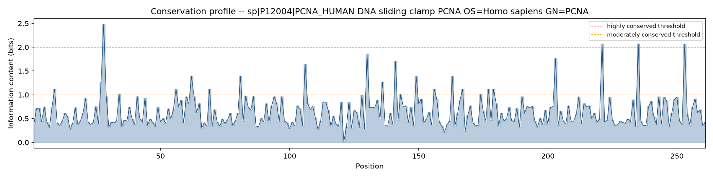
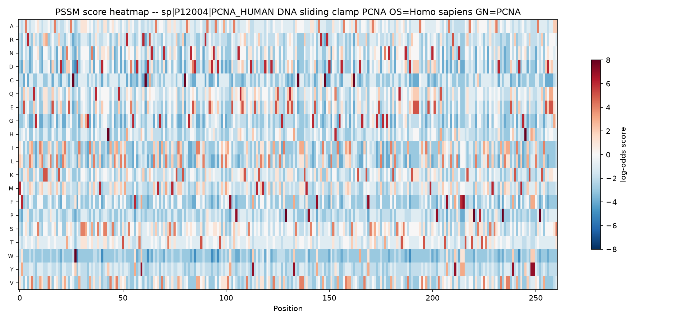

# PSSM Interpretation Report

**Query:** Query_11307923  
**Title:** sp|P12004|PCNA_HUMAN DNA sliding clamp PCNA OS=Homo sapiens GN=PCNA  
**Length:** 261 residues  
**Karlin-Altschul kappa:** 0.0419487820827712

## Summary

The PSSM for sp|P12004|PCNA_HUMAN DNA sliding clamp PCNA OS=Homo sapiens GN=PCNA (261 positions) shows 2% of residues are highly conserved and a further 8% are moderately conserved, based on information content computed from the profile's own frequency ratios. The strongest conservation signals are at positions W28, P221, P235, P253, which are good candidates for functionally or structurally important residues. Positions this conserved are commonly associated with active sites, ligand/DNA binding surfaces, protein-protein interfaces, or residues required to maintain the structural fold -- not necessarily any one of these, but conservation this strong rarely happens by chance.

## Top 10 most conserved positions

| Position | Wild residue | IC (bits) | Favored | Rejected |
|---|---|---|---|---|
| 28 | W | 2.48 | W(11) | A(-3);R(-3);C(-3);E(-3);G(-3);H(-3);I(-3);K(-3);S(-3);T(-3);V(-3);N(-4);P(-4);D(-5) |
| 221 | P | 2.071 | P(8) | C(-3);I(-3);L(-3);M(-3);Y(-3);V(-3);F(-4);W(-4) |
| 235 | P | 2.071 | P(8) | C(-3);I(-3);L(-3);M(-3);Y(-3);V(-3);F(-4);W(-4) |
| 253 | P | 2.069 | P(8) | C(-3);I(-3);L(-3);M(-3);Y(-3);V(-3);F(-4);W(-4) |
| 130 | P | 1.861 | P(8) | C(-3);I(-3);L(-3);F(-3);W(-3);Y(-3) |
| 203 | P | 1.761 | P(7) | C(-3);I(-3);L(-3);Y(-3);F(-4);W(-4) |
| 141 | P | 1.702 | P(7) | C(-3);F(-3);Y(-3);W(-4) |
| 106 | P | 1.648 | P(7) | C(-3);L(-3);Y(-3);F(-4);W(-4) |
| 62 | C | 1.388 | C(9) | N(-3);Q(-3);G(-3);H(-3);K(-3);F(-3);P(-3);W(-3);Y(-3);R(-4);D(-4);E(-4) |
| 81 | C | 1.388 | C(9) | N(-3);Q(-3);G(-3);H(-3);K(-3);F(-3);P(-3);W(-3);Y(-3);R(-4);D(-4);E(-4) |

Full per-position data: `pssm_analysis.csv`

## Interpretation notes

Positions this conserved are commonly associated with active sites, ligand/DNA binding surfaces, protein-protein interfaces, or residues required to maintain the structural fold -- not necessarily any one of these, but conservation this strong rarely happens by chance.

**Scope note:** this report is derived entirely from the PSSM's own scores and frequency data. It does not (yet) cross-reference structure, domain databases (Pfam/CDD), or literature -- those require separate, verifiable integrations and are intentionally out of scope for this version so nothing here overstates what the profile alone can support.